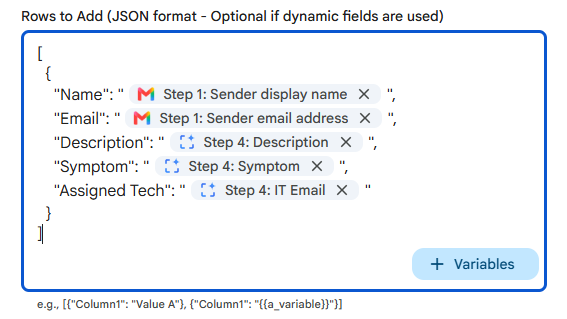
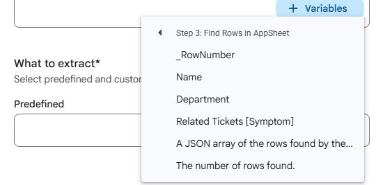

Before we jump in a quick backstory, if nothing else to prove this entire post wasn’t written with Gemini assistance. Just over a year ago I was fortunate to be a Workspace Studio tester (or Flows as was it called then). I was particularly excited by the ability of [Extending Google Workspace Flows with Custom Steps using Google Apps Script](https://pulse.appsscript.info/p/2025/11/beyond-no-code-extending-google-workspace-flows-with-custom-steps-using-google-apps-script/). As Workspace Studio moved through the Gemini Alpha program to general availability, custom steps disappeared. This is very understandable given Workspace Studio was a new product and Google wanted to make sure users got to access a stable platform. The great news Google has now launched [Automate workflows with custom starters and steps, third-party integrations, and webhooks in Workspace Studio](http://workspaceupdates.googleblog.com/2026/09/automate-workflows-with-custom-starters-and-steps-third-party-integrations-and-webhooks-in-Workspace-Studio.html).

With custom steps officially back I thought it was revisit an integration I had been experimenting with combining Workspace Studio with AppSheet. The code for this solution is published in the [AppSheet Custom Steps for Google Workspace Studio](https://github.com/mhawksey/appsheet-custom-studio-step-example) repo and in this post, we'll walk through:

1. **Why connect Workspace Studio to AppSheet?**  
2. **A Real-World Example: Intelligent IT Ticket Triage with Gemini & AppSheet**  
3. **How custom steps are structured in Apps Script (`appsscript.json`)**  
4. **The secret sauce: Dynamic schema discovery via Custom Resources**  
5. **Handling Single vs. Multiple Results: A Two-Tier Approach**  
6. **Testing & Deployment with Clasp (and the Admin Setting gotcha)**  
7. **How this project was built using AI coding agents with `.agents/` skills**

## Why Connect Workspace Studio and AppSheet?

Google Workspace Studio is great for automations across Google Workspace allowing you to use Gemini assistance. AppSheet serves as a no-code application platform making it easy to create solutions for your business data. AppSheet Enterprise customers can already use [Gemini AI automations to extract, categorise and summarize data](https://support.google.com/appsheet/answer/16045284), but getting data from a Workspace automation into AppSheet often required intermediary webhooks, custom API scripts, or relying on Google Workspace integrations to Sheets, Forms and Gmail.

With my custom Studio steps, powered by the AppSheet REST API, you have the ability to extend your apps capabilities using the [growing list of Workspace Studio starter steps](https://support.google.com/workspace-studio/table/17176961) integrating with your AppSheet app to:

* **Add Rows**: Directly push structured records into AppSheet tables.  
* **Update Rows**: Modify records and trigger AppSheet bot workflows in real time.  
* **Find Rows**: Run AppSheet formula expressions (such as `FILTER("Technicians", [On Call] = TRUE)`) and feed those records back into downstream Studio steps.

## A Real-World Example: Intelligent IT Ticket Triage with Gemini & AppSheet

To see how this works in practice, let's look at a common scenario, an automated IT helpdesk flow using a slightly modified version of the AppSheet standard **IT Ticketing** template.

In the IT Ticketing app the schema includes:

* The **`Tickets`** table tracks issues (`Issue ID`, `First Name`, `Last Name`, `Email`, `Description`, `Symptom`, `Assigned Tech`, `Date Created`, `Resolved`).  
* The **`Technicians`** table tracks staff (`Name`, `Department`, `IT Email`, `On Call` boolean, and `Can Cover` skills: *General Issues*, *Network*, *Website*, *Apps*). The primary key for this table is **`IT Email`**.  
* The **`Symptoms`** table stores the allowed categories (`Name`, `Department`), used as an AppSheet `Ref` dropdown in the app.

Rather than forcing users to fill out a form manually or relying on rigid routing rules, we can combine **Workspace Studio's Gmail starter**, **Gemini steps**, and our **AppSheet custom steps** into an autonomous triage pipeline:

```
[ Gmail Starter: New Support Email ]
                 │
                 ▼
[ Step 2 : Find Rows (Fetch On-Call Technicians) ]
                 │
                 ▼
[ Step 3: Find Rows (Fetch the apps Symptoms list) ]
                 │
                 ▼
[ Step 4: Extract (Gemini extracts the required data for our app) ]
                 │
                 ▼
[ Step 5: Add Rows (Create Ticket with Assigned Tech) ]
```

### Step-by-Step Flow Breakdown

1. **Starter (Gmail)**: Studio listens for incoming emails sent to `it-helpdesk@example.com` or flagged with `[IT Support]` in the subject line.  
2. **AppSheet Custom Step (Find Rows)**:  
   * Studio queries the `Technicians` table with the selector:  
     ```excel
     FILTER("Technicians", [On Call] = TRUE)
     ```  
3. **AppSheet Custom Step (Find Rows)**:  
   * Studio queries the `Symptoms` table for the current list
3. **Gemini Extract (Smart Triage)**:  
   * Studio passes both the cleaned ticket details, the on-call technician records and our apps symptoms list to Gemini:  
     > "Based on the issue description and identified symptom, review the list of on-call technicians and their 'Can Cover' competencies. Select the single best technician name to handle this ticket.
     >
     >Issue description:
     >[Step 1: Email subject]
     >[Step 1: Email body]
     >
     >Available technicians:
     >[Step 2: A JSON array of the rows found by the selector.]
     >
     >Symptoms:
     >[Step 3: A JSON array of the rows found by the selector.]"  
   * Gemini evaluates availability and skill match, extracting data:
     > IT Email: Email address of the technician
     > Symptom: The most suitable classification from the symptoms list
     > Description: A short description of the issue
5. **AppSheet Custom Step (Add Rows)**:  
   * Studio inserts the new record into `Tickets`.  
   * The step outputs **`addedRow`**, immediately exposing newly generated fields (like `Ticket ID` or calculated dates) for the rest of the flow.  
     ```json
      [
        {
          "Name": "{{Step 1.Starter.Sender Display Name}}",
          "Email": "{{Step 1.Starter.Sender Email}}",
          "Description": "{{Step 4.Gemini.Description}}",
          "Symptom": "{{Step 4.Gemini.Symptom}}",
          "Assigned Tech": "{{Step 4.Gemini.IT Email}}"
        }
      ]
     ```



This pattern demonstrates the true power of combining Workspace Studio and AppSheet: Studio orchestrates Workspace events and AI reasoning, while AppSheet provides validated, relational business data.

---

## The Anatomy of a Workspace Studio Custom Step

Under the hood, a Workspace Studio custom step is an extension of the **Google Workspace Add-on** architecture defined in `appsscript.json`.

Each step declares its inputs, outputs, and two primary Apps Script callback functions:

1. `onConfigFunction`: Renders the configuration card displayed in the Studio sidebar when a user selects your step.  
2. `onExecuteFunction`: Receives input variable bindings at runtime, executes the business logic, and returns output variables back to the flow.

Here is an extract from `appsscript.json` defining the "Add Rows" step, featuring both bulk JSON outputs and the **Dynamic Custom Resource (`addedRow`)**:

```json
{
  "id": "appsheet_add_rows",
  "state": "ACTIVE",
  "name": "Add Rows in AppSheet",
  "description": "Adds one or more rows to a specified AppSheet table.",
  "workflowAction": {
    "inputs": [
      { "id": "appId", "cardinality": "SINGLE", "dataType": { "basicType": "STRING" } },
      { "id": "accessKey", "cardinality": "SINGLE", "dataType": { "basicType": "STRING" } },
      { "id": "tableName", "cardinality": "SINGLE", "dataType": { "basicType": "STRING" } },
      { "id": "rowsData", "cardinality": "SINGLE", "dataType": { "basicType": "STRING" } }
    ],
    "outputs": [
      {
        "id": "addedRow",
        "description": "The first newly added row with individual column fields.",
        "cardinality": "SINGLE",
        "dataType": {
          "resourceType": {
            "workflowResourceDefinitionId": "appsheet_row_resource"
          }
        }
      },
      {
        "id": "addedRows",
        "description": "The full rows added, including server-computed values.",
        "cardinality": "SINGLE",
        "dataType": { "basicType": "STRING" }
      }
    ],
    "onConfigFunction": "onConfigAddRows",
    "onExecuteFunction": "onExecuteAddRows"
  }
}
```

Notice that `addedRow` has a `dataType` pointing to `appsheet_row_resource`. At the top level of `addOns.flows`, we declare this custom resource alongside a dynamic definition provider:

```json
"workflowResourceDefinitions": [
  {
    "id": "appsheet_row_resource",
    "name": "AppSheet Row",
    "providerFunction": "onDynamicAppSheetRowProvider",
    "resourceType": "DYNAMIC"
  }
],
"dynamicResourceDefinitionProvider": "onDynamicAppSheetRowDefinition"
```

## Dynamic Schema Discovery via Custom Resources

One challenge with database integrations in no-code flow builders is usability. Asking users to hand-write raw JSON payloads or use secondary "Extract" steps to parse out field names isn't straightforward.

Initially, I tried adding interactive buttons in the configuration card (e.g. a "Fetch Columns" button). However, Google Workspace Studio does not currently display interactive CardService action buttons or in-place card replacement widgets.

Whilst it is not possible to dynamically add input fields to a step, you can dynamically expose the outputs using **Dynamic Custom Resources**. With Dynamic Custom Resources, you can dynamically update the schemas to define individual column variables automatically.



### How it Works Behind the Scenes

1. **Design-Time Schema Introspection (`onDynamicAppSheetRowDefinition`)**:  
   When the user configures the step in Studio (entering their App ID, Access Key, and Table Name), Studio calls `onDynamicAppSheetRowDefinition(e)`. Apps Script queries AppSheet using `TOP(FILTER("Table", TRUE), 1)` to discover existing column headers, registering each as an individual `ResourceField`:

```js
function onDynamicAppSheetRowDefinition(e) {
  const resourceDefinitions = AddOnsResponseService.newDynamicResourceDefinition()
    .setResourceId("appsheet_row_resource");

  const inputs = e.workflow?.resourceFieldsDefinitionRetrieval?.inputs || {};
  const appId = inputs.appId?.stringValues?.[0];
  const accessKey = inputs.accessKey?.stringValues?.[0];
  const tableName = inputs.tableName?.stringValues?.[0];

  if (appId && accessKey && tableName) {
    const AppSheet = new AppSheetApp(appId, accessKey);
    // Fetch schema sample (cached for 6 hours to keep editor fast)
    const sample = AppSheet.Find(tableName, [], { "Selector": `TOP(FILTER("${tableName}", TRUE), 1)` });
    if (sample && sample.length > 0) {
      Object.keys(sample[0]).forEach(colName => {
        resourceDefinitions.addResourceField(
          AddOnsResponseService.newResourceField()
            .setSelector(colName)
            .setDisplayText(colName)
        );
      });
    }
  }

  const workflowAction = AddOnsResponseService.newResourceFieldsDefinitionRetrievedAction()
    .addDynamicResourceDefinition(resourceDefinitions);

  return AddOnsResponseService.newRenderActionBuilder()
    .setHostAppAction(AddOnsResponseService.newHostAppAction().setWorkflowAction(workflowAction))
    .build();
}
```

2. **Step Execution & Caching (`onExecuteFunction`)**:  
   When the step runs, it executes the AppSheet API operation, caches the row data in `CacheService` under a unique UUID (`"row_find_" + Utilities.getUuid()`), and returns a resource reference variable alongside the standard JSON output:

```js
const variables = {
  "firstRow": AddOnsResponseService.newVariableData().addResourceReference(resourceId),
  "foundRows": AddOnsResponseService.newVariableData().addStringValue(JSON.stringify(foundRows)),
  "rowCount": AddOnsResponseService.newVariableData().addIntegerValue(foundRows.length)
};
```

3. **Runtime Value Resolution (`onDynamicAppSheetRowProvider`)**:  
   When a downstream step references a chip like `Step 2 > First row > IT Email`, Studio calls `onDynamicAppSheetRowProvider(e)` with the `resourceId`. The provider grabs the cached row and returns the requested column values on the fly.

---

## Handling Single vs. Multiple Results: A Two-Tier Approach

When building steps that interact with databases, you inevitably face a question: *What happens if the query returns one row versus ten rows versus zero rows?*

In Google Workspace Studio's currently, **custom resources strictly mandate `"cardinality": "SINGLE"`**:

> *"The output variable has a dataType with the property resourceType. The value of cardinality must be SINGLE."*

Because Studio does not yet support repeated arrays of custom resource chips, our custom steps implement a **two-tier output design**:

| Step | Output Variable | Type & Cardinality | Best For | Behavior |
| :---- | :---- | :---- | :---- | :---- |
| **Find Rows** | **`firstRow`** | Dynamic Custom Resource (`SINGLE`) | **Single result** / First match | Exposes individual column chips (`Email`, `Name`, `ID`, etc.) directly to downstream steps. |
|  | **`foundRows`** | String (JSON Array) (`SINGLE`) | **Multiple results** | Contains the full JSON array `[ {...}, {...} ]` of all matching rows. |
|  | **`rowCount`** | Integer (`SINGLE`) | **Conditionals & branching** | The total number of rows found (`0`, `1`, `5`, etc.). |
| **Add Rows** | **`addedRow`** | Dynamic Custom Resource (`SINGLE`) | **Single record** added | Exposes column chips of the newly created row (useful for generated IDs or computed columns). |
|  | **`addedRows`** | String (JSON Array) (`SINGLE`) | **Bulk additions** | Full JSON array of all rows inserted. |
| **Update Rows** | **`updatedRow`** | Dynamic Custom Resource (`SINGLE`) | **Single record** updated | Exposes column chips of the updated record. |
|  | **`updatedRows`** | String (JSON Array) (`SINGLE`) | **Bulk updates** | Full JSON array of all updated rows. |

### How Flows Use This in Practice:

* **Single Record Workflows**: Use **`firstRow`**, **`addedRow`**, or **`updatedRow`** chips directly in downstream steps (Gmail, Google Docs, Slack, Chat) without any formula or extraction step. If 0 rows match, chips safely resolve to empty strings (`""`).  
* **Multi-Record Collections**: Pass `foundRows` (JSON string) directly into the `rowsData` input of another step or iterate over the collection using Studio list actions.  
* **Conditional Logic**: Add a Studio branch on `rowCount > 0` to safeguard downstream actions when records might not exist.

---

## Testing & Deployment with Clasp

Because Studio custom steps run on Google Workspace Add-on infrastructure, testing is fast:

1. Either [Copy with Apps Script project](https://script.google.com/home/projects/1EM4vv7-gJFM2tKOYwDAMKMmrWPUp7jI6TSq2hTPm9NmROcgQZ4h61V12) or [follow the steps to clone the repo and push via clasp](https://github.com/mhawksey/appsheet-custom-studio-step-example/blob/main/README.md#method-a-deploy-with-clasp-recommended):

2. **Install the Test Deployment**: Open the Apps Script project, go to **Deploy \> Test deployments**, select **Google Workspace Add-on**, and click **Install**.  
3. **Use in Studio**: Head to [studio.workspace.google.com](https://studio.workspace.google.com/), add a step to any flow, and search for **"AppSheet Utilities for Studio"**.

> \[\!IMPORTANT\] **Admin Setting Required for Google Workspace Accounts**:  
> As announced in the [Google Workspace Updates](https://workspaceupdates.googleblog.com/2026/09/automate-workflows-with-custom-starters-and-steps-third-party-integrations-and-webhooks-in-Workspace-Studio.html), custom steps are **OFF by default** for Google Workspace accounts.

> If you see a lock icon stating *"🔒 Access to these steps is restricted by your Workspace admin"*, have a domain admin navigate to:  
> **Google Admin Console \> Apps \> Google Workspace \> Settings for Workspace Studio \> Custom steps settings**  
> Turn custom steps **ON** and check **"Allow unpublished (test) custom steps"**.

## AI-Assisted Development with `.agents/`

An interesting aspect of developing for newly released or evolving APIs like Workspace Studio is that public LLMs often have knowledge cutoffs or hallucinate manifest formats and Card Service specifications.

To build this project efficiently, the repository includes a curated [`.agents/`](https://github.com/mhawksey/appsheet-custom-studio-step-example/tree/main/.agents) directory containing specialized runbooks, rules, and reference specs:

* **Contract Parity**: Enforces that input/output IDs in `appsscript.json` match `Code.js` execution handlers.  
* **Real-time API Adaptation**: When testing revealed that Studio sidebar cards don't render interactive card buttons, the agent used the reference docs to quickly pivot to native **Dynamic Custom Resources** (`dynamicResourceDefinitionProvider`).  
* **Platform Constraints**: Encodes crucial platform invariants—like the requirement that `dataType.resourceType` outputs mandate `"cardinality": "SINGLE"`—saving hours of trial and error.  
* **AppSheet Selectors**: Pre-validated AppSheet formula expressions (`FILTER`, `SELECT`, `TOP`) for REST API calls.

When working with tools like Gemini Code Assist or AI coding agents, these in-repo skills guide the model to write accurate, production-ready code on the first attempt and navigate rapid API evolutions.

## Summary and Next Steps

Having custom steps and starters back in Workspace Studio opens up huge possibilities for developers. Google Apps Script acts as the glue code, letting you build custom integrations for internal systems, specialized SaaS platforms, or databases like AppSheet.

You can find the complete source code and clasp setup instructions on GitHub: 👉 [**mhawksey/appsheet-custom-studio-step-example**](https://github.com/mhawksey/appsheet-custom-studio-step-example)