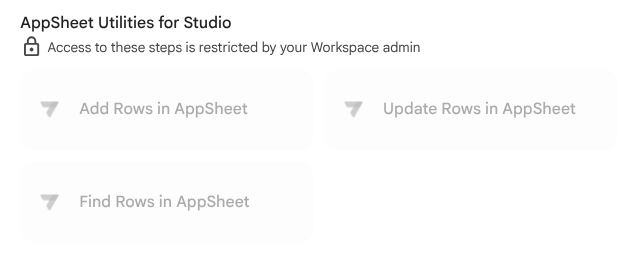
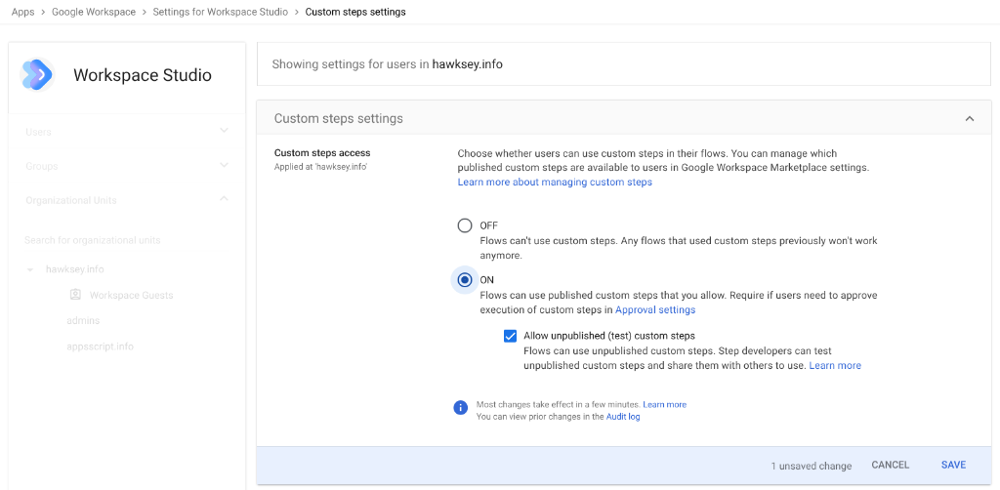

# AppSheet Custom Steps for Google Workspace Studio

Custom step and starter extensions for **Google Workspace Studio** (formerly Workspace Flows) that enable automated workflows to interact directly with **AppSheet** databases and applications via Google Apps Script.

---

## 📖 Overview

Google Workspace Studio allows users to build multi-step automations across Google Workspace and external applications. This project extends Studio with custom steps that bridge workflows with AppSheet via the AppSheet REST API:

* **Add Rows to AppSheet (`appsheet_add_rows`)**: Inserts new rows into an AppSheet table. Outputs both stringified JSON (`addedRows`) and a **Dynamic Custom Resource (`addedRow`)** that exposes individual column variable chips directly in Studio.
* **Update Rows in AppSheet (`appsheet_update_rows`)**: Updates existing rows in an AppSheet table based on row key values. Outputs both `updatedRows` and a **Dynamic Custom Resource (`updatedRow`)** exposing column variable chips.
* **Find Rows in AppSheet (`appsheet_find_rows`)**: Queries rows using standard AppSheet formula expressions (`FILTER()`, `SELECT()`, `TOP()`, `ORDERBY()`). Outputs full JSON (`foundRows`), count (`rowCount`), and a **Dynamic Custom Resource (`firstRow`)** exposing individual column variable chips.

### Key Capabilities
* **Dynamic Output Variables (Custom Resources)**: Implements Workspace Studio's `workflowResourceDefinitions` and `dynamicResourceDefinitionProvider`. Studio dynamically inspects the table schema at design time and provides individual column variable chips (`Name`, `Email`, `Department`, `Ticket ID`, etc.) for subsequent steps, eliminating the need for intermediate "Extract" steps in flows!
* **Dynamic Variable Binding**: Input widgets support `setIncludeVariables(true)`, allowing users in the Studio flow builder to map output chips from previous flow steps into AppSheet fields.
* **Actionable & Retryable Error Handling**: Implements `AddOnsResponseService` error handling. User errors (like missing parameters) display a "Fix input" link on the Studio Activity tab; transient network or rate-limit errors trigger automatic flow retries.

---

## 📊 Output Variables & Handling Single vs. Multiple Results

To support both simple record lookups and bulk/batch processing, the custom steps use a **two-tier output design**:

| Step | Output Variable | Type & Cardinality | Best For | Description |
| :--- | :--- | :--- | :--- | :--- |
| **Find Rows** | **`firstRow`** | Dynamic Custom Resource (`SINGLE`) | **Single result** / First match | Exposes individual column chips (`Email`, `Name`, `ID`, etc.) directly to downstream steps. |
| | **`foundRows`** | String (JSON Array) (`SINGLE`) | **Multiple results** | Contains the full JSON array `[ {...}, {...} ]` of all matching rows. |
| | **`rowCount`** | Integer (`SINGLE`) | **Conditionals & branching** | The total number of rows found (`0`, `1`, `5`, etc.). |
| **Add Rows** | **`addedRow`** | Dynamic Custom Resource (`SINGLE`) | **Single record** added | Exposes column chips of the newly created row (useful for generated IDs or computed columns). |
| | **`addedRows`** | String (JSON Array) (`SINGLE`) | **Bulk additions** | Full JSON array of all rows inserted. |
| **Update Rows** | **`updatedRow`** | Dynamic Custom Resource (`SINGLE`) | **Single record** updated | Exposes column chips of the updated record. |
| | **`updatedRows`** | String (JSON Array) (`SINGLE`) | **Bulk updates** | Full JSON array of all updated rows. |

### 1. Working with Single Results (or "First Matching" Record)
When your flow looks up a specific entity (e.g., finding the technician currently on call, looking up a customer by email, or creating a new ticket):
* **Direct Variable Chips**: Downstream steps can pick individual column chips directly under **`Step > First row`**, **`Step > Added row`**, or **`Step > Updated row`** (e.g., `Technician ID`, `Email`, `On Call`). No parsing or extraction steps are required.
* **Zero Results Behavior**: If `Find Rows` finds `0` matching rows:
  * `rowCount` is `0`.
  * The cached `firstRow` resource is empty; downstream chips resolve safely to empty strings (`""`) without crashing the flow.
  * You can insert a standard Studio conditional branch (`if rowCount > 0`) before using the chips.

### 2. Working with Multiple Results
When a query returns a list or table of records (e.g., 5 open tickets or all active technicians):
* **Platform Architecture Note**: In Google Workspace Studio's current limited preview, **custom resources strictly mandate `cardinality: "SINGLE"`**:
  > *"The output variable has a dataType with the property resourceType. The value of cardinality must be SINGLE."*  
  *(Workspace Studio does not currently support arrays of custom resource chips).*
* **How Flows Consume Multiple Results**:
  1. **Batch Chaining**: Pass `foundRows` (JSON string) directly into the `rowsData` input of another step (e.g. Find Rows $\rightarrow$ Add/Update Rows in another table).
  2. **Count Branching**: Use `rowCount` in conditional branches (e.g., *"If rowCount > 1, send an alert email"*).
  3. **List / Loop Processing**: Use Studio list actions or custom scripts that consume the `foundRows` JSON array for iteration.

---

## 🚀 Quickstart: Copy & Test Deploy

### Prerequisites
* [Node.js](https://nodejs.org/) (v18+) and npm.
* Google Account with access to [Google Workspace Studio](https://studio.workspace.google.com/) and [AppSheet](https://www.appsheet.com/).
* `@google/clasp` installed globally (`npm install -g @google/clasp`).

> [!IMPORTANT]
> **Admin Setting Required for Google Workspace Accounts**:  
> As announced in the [Google Workspace Updates (September 2026)](https://workspaceupdates.googleblog.com/2026/09/automate-workflows-with-custom-starters-and-steps-third-party-integrations-and-webhooks-in-Workspace-Studio.html), custom steps are **OFF by default** for Google Workspace accounts.
>
> If custom steps or test custom steps are disabled in your domain, adding the steps in Workspace Studio displays a lock icon with the message:  
> **"🔒 Access to these steps is restricted by your Workspace admin"**
>
> 
>
> **How to Enable (Google Workspace Admins)**:
> 1. Open the [Google Admin Console](https://admin.google.com/) as a domain administrator.
> 2. Navigate to **Apps** > **Google Workspace** > **Settings for Workspace Studio** > **Custom steps settings**.
> 3. Under **Custom steps access**, select **ON**.
> 4. Check the box **Allow unpublished (test) custom steps** (*"Flows can use unpublished custom steps. Step developers can test unpublished custom steps and share them with others to use."*).
> 5. Click **Save**. Most changes take effect within a few minutes.
>
> 
>
> *(Note: Consumer `@gmail.com` accounts appear to not have this admin restriction and can test unpublished custom steps directly).*


---

### Method A: Deploy with Clasp (Recommended)

1. **Clone and Install Dependencies**:
   ```bash
   git clone https://github.com/mhawksey/appsheet-custom-studio-step-example.git
   cd appsheet-custom-studio-step-example
   npm install
   ```

2. **Authenticate Clasp**:
   ```bash
   clasp login
   ```

3. **Link to Your Google Apps Script Project**:
   * If you have an existing Apps Script project, update `.clasp.json` with your `scriptId`:
     ```json
     {
       "scriptId": "YOUR_SCRIPT_ID_HERE",
       "rootDir": "src"
     }
     ```
   * Or create a new standalone project:
     ```bash
     clasp create --title "AppSheet Studio Steps" --rootDir src --type standalone
     ```

4. **Push the Code**:
   ```bash
   npm run push
   # or: clasp push
   ```

---

### Method B: Manual Copy into Apps Script

1. Open [Google Apps Script](https://script.google.com/) and create a **New project**.
2. Click **Project Settings** (gear icon) and check **Show "appsscript.json" manifest file in editor**.
3. Copy the contents of the following files into your project:
   * [`src/appsscript.json`](src/appsscript.json) (replace existing manifest content)
   * [`src/Code.js`](src/Code.js)
   * [`src/AppSheetApp.js`](src/AppSheetApp.js)
4. Save the project (`Ctrl+S` / `Cmd+S`).

---

### Install the Test Deployment in Workspace Studio

1. Open your Apps Script project in the browser:
   ```bash
   npm run open
   # or: clasp open
   ```
2. In the top-right corner, click **Deploy** > **Test deployments**.
3. Select **Google Workspace Add-on** (click the gear icon if not selected).
4. Click **Install**. The add-on status will display **Installed for test**.
5. Navigate to [Google Workspace Studio](https://studio.workspace.google.com/).
6. Open an existing flow or create a new flow.
7. Click the **+** (Add step) button and search for **AppSheet Utilities for Studio** or **Add Rows to AppSheet**.
8. Select the step to open the configuration card in the sidebar.  
   *(If the step is disabled with a lock icon reading "Access to these steps is restricted by your Workspace admin", ensure your administrator has enabled Custom steps access and "Allow unpublished (test) custom steps" as detailed in the Prerequisites above).*
9. Enter your **AppSheet App ID**, **Access Key**, and **Table Name**, and map any preceding step output variables.
10. Test-run the flow and inspect the [Activity Tab](https://studio.workspace.google.com/manage?tab=activity) to view real-time logs and outputs.

---

## 🛠️ Extending the Project

### Adding a New Custom Step

To add a new custom step (e.g., `appsheet_delete_rows`):

1. **Register in Manifest (`appsscript.json`)**:
   Add a new entry under `addOns.flows.workflowElements`:
   ```json
   {
     "id": "appsheet_delete_rows",
     "state": "ACTIVE",
     "name": "Delete Rows in AppSheet",
     "description": "Deletes rows by key in AppSheet.",
     "workflowAction": {
       "inputs": [ ... ],
       "outputs": [ ... ],
       "onConfigFunction": "onConfigDeleteRows",
       "onExecuteFunction": "onExecuteDeleteRows"
     }
   }
   ```

2. **Implement the Configuration Card (`Code.js`)**:
   Define `onConfigDeleteRows(e)` returning a `CardService.Card` with inputs configured with `setIncludeVariables(true)`.

3. **Implement the Execution Handler (`Code.js`)**:
   Define `onExecuteDeleteRows(e)` to extract typed inputs from `e.workflow.actionInvocation.inputs`, execute the delete via `AppSheetApp.js`, and return outputs using `AddOnsResponseService.newReturnOutputVariablesAction()`.

4. **Push Updates**:
   ```bash
   npm run push
   ```
   *Because test deployments target the live `@HEAD` code, updates take effect immediately in Workspace Studio upon pushing.*

---

## 🤖 AI-Assisted Development with `.agents/`

This repository includes a pre-configured [`.agents/`](.agents/) directory containing specialized knowledge, references, and validation rules. When pair programming with AI assistants (such as **Google Antigravity**, **Gemini Code Assist**, or AI coding agents), the assistant automatically ingests these skills:

```
.agents/
├── rules/
│   └── workspace-studio-rules.md          # Contract parity, defensive parsing & safety rules
└── skills/
    ├── workspace-studio-steps/             # Workspace Studio Custom Step & Starter Skill
    │   ├── SKILL.md                       # Core 4-phase step development runbook
    │   ├── references/                    # Manifest specs, CardService guide, event parsing, error logs
    │   └── examples/                      # Mock event test harness
    │
    ├── clasp-workflow/                     # Clasp CLI & Apps Script Management Skill
    │   ├── SKILL.md                       # Clasp sync, versioning, and test deployment runbook
    │   ├── references/                    # CLI cheatsheet, .claspignore guide, GCP linking & Cloud Logging
    │   └── examples/                      # GitHub Actions automated deployment workflow
    │
    └── appsheet-api-integration/           # AppSheet REST API & Schema Mapping Skill
        ├── SKILL.md                       # REST API integration runbook
        └── references/                    # Endpoints, formula expressions (FILTER, SELECT), schema discovery
```

### How the AI Agent Uses These Skills:
* **Zero-Hallucination Manifests**: The agent strictly aligns `appsscript.json` inputs/outputs with your execution handler signatures using [manifest-spec.md](.agents/skills/workspace-studio-steps/references/manifest-spec.md).
* **Card UI Patterns**: When generating configuration cards, the agent automatically includes `setIncludeVariables(true)` and dynamic section replacements using [card-ui-guide.md](.agents/skills/workspace-studio-steps/references/card-ui-guide.md).
* **Safe Input Extraction**: Follows [execution-and-events.md](.agents/skills/workspace-studio-steps/references/execution-and-events.md) to parse both typed arrays and string representations defensively.
* **AppSheet Formulas**: Automatically generates correct AppSheet selector expressions using [appsheet-selectors.md](.agents/skills/appsheet-api-integration/references/appsheet-selectors.md).
* **Clasp & Secret Protection**: Enforces `.claspignore` rules to ensure credentials, test fixtures, and agent files never leak to Google Apps Script.

---

## 🔒 Security Best Practices

* **Application Access Keys**: Never hardcode AppSheet keys into `src/Code.js` or `src/appsscript.json`. Pass them via step input variables or retrieve them securely via `PropertiesService.getScriptProperties()`.
* **Clasp Hygiene**: Keep [`.claspignore`](.claspignore) updated so that documentation, `.agents/`, and npm modules are never pushed to the remote script project. Note: `src/.env.js` is pushed by Clasp for test execution but is ignored by Git (`.gitignore`).
* **Scope Minimization**: Ensure `oauthScopes` in `src/appsscript.json` only requests necessary permissions (`https://www.googleapis.com/auth/script.external_request`).

---

## 📄 License

This project is licensed under the Apache 2.0 License.
